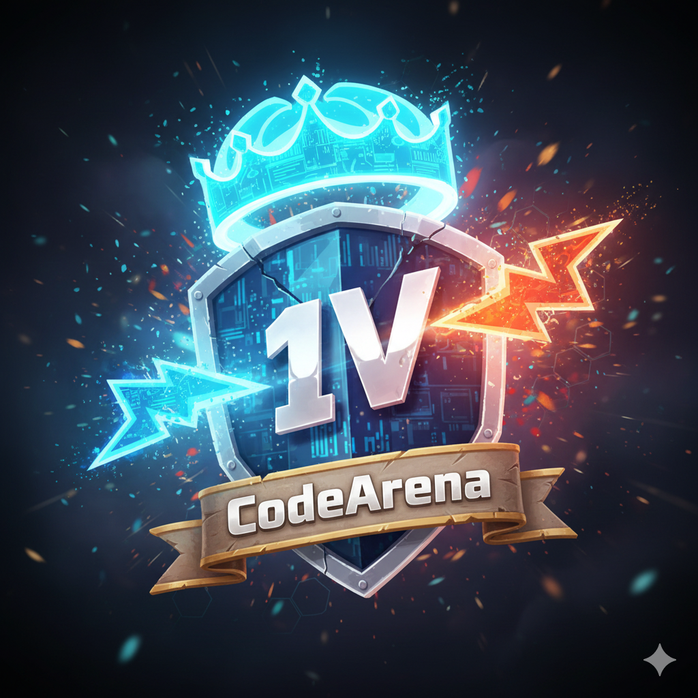

🛡️ CodeArena 1v1

<div align="center">

<h1>The Ultimate Real-Time Competitive Coding Platform</h1>
<p>
<b>Battle friends in 1v1 coding duels with zero-latency synchronization, live execution, and instant judging.</b>
</p>
<a href="https://code-arena-1v1.vercel.app/">View Demo</a> •
<a href="#-installation--setup">Installation</a> •
<a href="#-architecture">Architecture</a>
</div>


📖 Overview
-> CodeArena 1v1 is a full-stack MERN application designed to gamify the coding interview experience. It allows two developers to join a private room and solve algorithmic problems simultaneously.
-> What sets CodeArena apart is its real-time collaboration engine. Unlike standard coding platforms, you can see your opponent's cursor and code typing in real-time (read-only view), adding psychological pressure and excitement to the match.


✨ Key Features

⚔️ The Battle Arena
1. 1v1 Matchmaking: Create unique rooms and invite friends via Room ID.
2. Real-Time Sync: Built with Yjs & WebSockets, enabling character-by-character synchronization ( < 30ms latency).
3. Live Presence: See your opponent's cursor and typing live.
4. Language Support: C++, Python, Java, and JavaScript.
5. Code Execution: Run code against public test cases instantly.


🤖 Judging & Scoring
1. Sandboxed Runner: Integrated with Piston API to securely execute untrusted code.
2. Auto-Judging: Validates solutions against multiple test cases (public & hidden).
3. Sequential Testing: Robust execution pipeline prevents API rate limiting.
4. Scoring: Earn points (+10) for every correct submission.


🏆 Gamification & Stats
1. Ranking System: Start as a Novice and climb to Grandmaster based on matches played.
2. Match History: Detailed logs of wins, losses, and opponents stored permanently.
3. Live Scoreboard: Instant score updates during the match.
4. Total Users: Real-time counter of total registered users and currently online users.


🎨 Professional UI/UX
1. Glassmorphism Design: Modern, dark-themed UI with Tailwind CSS.
2. Responsive: Fully optimized for desktop and large screens.
3. Themes: Built-in Dark/Light mode toggle.
4. Loading States: Smooth transitions and loading overlays for a premium feel.


🛠️ Tech Stack

| Area         | Tech                                             |
| ------------ | ------------------------------------------------ |
| Frontend     | React (Vite), Tailwind CSS, CodeMirror 6         |
| Sync / State | Socket.IO Client, Yjs, y-websocket, y-codemirror |
| Backend      | Node.js, Express, Socket.IO Server               |
| DB           | MongoDB (Mongoose)                               |
| Execution    | Piston API (or your sandboxed runner)            |
| Deployment   | Vercel (frontend), Render (backend)              |


🧩 Architecture
The application uses a Dual-Socket Architecture:
1. Game Logic Socket (Port 5000): Handles room joining, starting matches, scoring, and game-over states.
2. Collaboration Socket (Port 10000): A dedicated y-websocket server handles the high-frequency keystroke synchronization to keep the editors perfectly synced without overloading the main game logic.

```mermaid
graph TD
  ClientA[Browser: Player A] -->|HTTP/REST| API[Express API]
  ClientB[Browser: Player B] -->|HTTP/REST| API
  ClientA -->|Socket.IO (Events)| GameServer[Game Logic Server]
  ClientB -->|Socket.IO (Events)| GameServer
  ClientA -->|WebSockets (CRDT)| YjsServer[Yjs Sync Server]
  ClientB -->|WebSockets (CRDT)| YjsServer
  API --> MongoDB[(MongoDB Atlas)]
  API --> Piston[Piston Code Runner]


🚀 Installation & Local Setup
Follow these steps to run CodeArena locally.
Prerequisites
-> Node.js (v18 or higher)
-> MongoDB Atlas Account (or local MongoDB)


1. Clone the Repository
-> git clone [https://github.com/Maayank18/CodeArena-1v1.git](https://github.com/Maayank18/CodeArena-1v1.git)
-> cd CodeArena-1v1


2. Backend Setup
cd backend
npm install

# 1. Create a .env file
touch .env

# 2. Seed the database with DSA problems (Critical Step)
node seeder.js

# 3. Start the Main Server
npm run dev


backend/.env content:
PORT=5000
MONGO_URI=your_mongodb_connection_string
JWT_SECRET=your_super_secret_key
FRONTEND_URL=http://localhost:5173


3. Collaboration Server Setup (Terminal 2)
Open a new terminal to run the Yjs sync server.
cd backend
npm run yjs


It should say: "running at 'localhost' on port 1234"
4. Frontend Setup (Terminal 3)
cd frontend
npm install
npm run dev


frontend/.env content:
VITE_API_URL=http://localhost:5000
VITE_YJS_URL=ws://localhost:1234


🌍 Deployment Guide


Backend (Render)
-> Create a Web Service for the API (npm start).
-> Create a Separate Web Service for Yjs (npm run yjs).
-> Env Vars: MONGO_URI, JWT_SECRET, FRONTEND_URL (your Vercel link).
-> Important: For Yjs service, set PORT=10000.


Frontend (Vercel)
Import repository.
Set Root Directory to frontend.
Env Vars:
VITE_API_URL: https://your-api.onrender.com
VITE_YJS_URL: wss://your-yjs.onrender.com

📸 Screenshots
Landing Page
A sleek entry point for users to Login or Sign Up.
Dashboard
Create or Join rooms, view stats, and see live user counts.
The Arena
The core battle interface with real-time code sync and live judging.

🤝 Contributing
Contributions are what make the open-source community such an amazing place to learn, inspire, and create. Any contributions you make are greatly appreciated.

Fork the Project
Create your Feature Branch (git checkout -b feature/AmazingFeature)
Commit your Changes (git commit -m 'Add some AmazingFeature')
Push to the Branch (git push origin feature/AmazingFeature)
Open a Pull Request


## 🛡️ License
This project is licensed under a restricted **All Rights Reserved** license.  
You may view the source, but copying or commercial use is prohibited without permission.

See the [LICENSE](./LICENSE) file for full details.


<div align="center">
Design and Developed by <b>Mayank</b>
</div>
