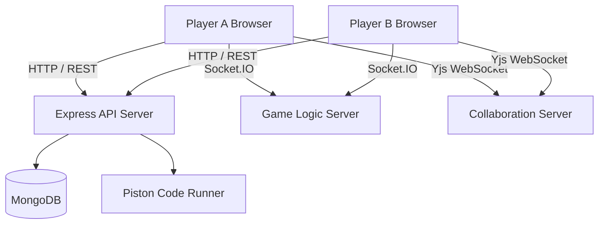

<div align="center">
  
  <h1>CodeArena 1v1</h1>
  <p><strong>The real-time competitive coding platform for intense 1v1 duels.</strong></p>
  <p>
    <a href="https://code-arena-1v1.vercel.app/">Live Demo</a>
    • <a href="#features">Features</a>
    • <a href="#installation">Installation</a>
    • <a href="#architecture">Architecture</a>
  </p>
</div>

## Overview

CodeArena 1v1 is a full-stack competitive coding platform built to deliver a polished, low-latency 1v1 coding experience.

Players can create private rooms, face off in real-time, and solve algorithmic challenges while watching their opponent's code progress in a secure, read-only spectator mode. The platform includes live scoring, automated judging, match history, rankings, and a responsive modern UI.

## Features

### Core Gameplay

- Private 1v1 matchmaking using unique room IDs.
- Real-time collaborative editor powered by Yjs and WebSockets.
- Read-only opponent preview with live cursor tracking.
- Fast code execution and result display.
- Public and hidden test case evaluation.

### Judging & Execution

- Secure sandboxed execution via Piston API.
- Automatic multi-test validation for each submission.
- Sequential execution flow to maintain performance and avoid API throttling.
- Instant feedback on correctness and runtime status.

### Gamification & Analytics

- Persistent match history with wins, losses, and opponent details.
- Ranking system that rewards continuous play and performance.
- Real-time score updates during matches.
- Live counters for registered users and active players.

### Platform Experience

- Modern responsive UI built with Tailwind CSS.
- Light / dark mode toggle for improved usability.
- Smooth loading states, notifications, and transitions.
- Structured dashboard for room creation, joining, and stats.

## Technology Stack

- Frontend: React, Vite, Tailwind CSS, CodeMirror 6
- Real-time Collaboration: Socket.IO, Yjs, y-websocket, y-codemirror
- Backend: Node.js, Express, Socket.IO
- Database: MongoDB with Mongoose
- Code Execution: Piston API integration
- Deployment: Frontend on Vercel, Backend on Render (recommended)

## Architecture

CodeArena separates game logic and editor synchronization into two dedicated services for scalability and stability.

- **Game Server**: Handles authentication, room and match state, scoring, and API routes.
- **Yjs Server**: Handles collaborative editor state, cursor presence, and real-time synchronization.


```mermaid
graph TD
  BrowserA[Player A Browser] -->|HTTP / REST| API[Express API Server]
  BrowserB[Player B Browser] -->|HTTP / REST| API

  BrowserA -->|Socket.IO| GameServer[Game Logic Server]
  BrowserB -->|Socket.IO| GameServer

  BrowserA -->|Yjs WebSocket| YjsServer[Collaboration Server]
  BrowserB -->|Yjs WebSocket| YjsServer

  API --> MongoDB[(MongoDB)]
  API --> Piston[Piston Code Runner]
```

## Installation

### Prerequisites

- Node.js 18 or higher
- MongoDB Atlas or local MongoDB instance
- Git

### 1. Backend Setup

```bash
cd backend
npm install
```

Create a `.env` file in `backend/` and add:

```env
PORT=5000
MONGO_URI=your_mongodb_connection_string
JWT_SECRET=your_jwt_secret
FRONTEND_URL=http://localhost:5173
```

Seed the database with problems:

```bash
node seeder.js
```

Start the backend server:

```bash
npm run dev
```

### 2. Collaboration Server Setup

Open a second terminal and start the Yjs sync server:

```bash
cd backend
npm run yjs
```

### 3. Frontend Setup

```bash
cd frontend
npm install
```

Create a `.env` file in `frontend/` and add:

```env
VITE_API_URL=http://localhost:5000
VITE_YJS_URL=ws://localhost:1234
```

Start the frontend server:

```bash
npm run dev
```

Access the app at `http://localhost:5173`.

## Deployment Notes

### Backend Deployment

- Deploy the API server to a service like Render or Heroku.
- Deploy the Yjs service separately, ensuring it has its own port.
- Configure environment variables for both services.

Recommended backend `.env` values:

```env
PORT=5000
MONGO_URI=your_production_mongodb
JWT_SECRET=your_production_jwt_secret
FRONTEND_URL=https://your-frontend-url
```

For the Yjs server:

```env
PORT=10000
```

### Frontend Deployment

- Deploy the `frontend/` directory to Vercel or a similar static hosting provider.
- Set the environment variables to point to your deployed backend and Yjs endpoints.

Recommended frontend `.env` values:

```env
VITE_API_URL=https://your-api-url
VITE_YJS_URL=wss://your-yjs-url
```

## Screenshots

### Landing Page


### Dashboard


### Battle Arena


## Contributing

Contributions are welcome.

1. Fork the repository.
2. Create a feature branch: `git checkout -b feature/your-feature`
3. Commit your changes: `git commit -m "Add feature"`
4. Push to your branch: `git push origin feature/your-feature`
5. Open a pull request.

## Project Structure

- `backend/` — API server, collaboration server, database models, controllers, routes, services
- `frontend/` — React app, UI components, styles, environment configuration
- `LICENSE` — License and usage terms

## License

This project is governed by the terms in the [LICENSE](./LICENSE) file.

> Built and designed by **Mayank**
