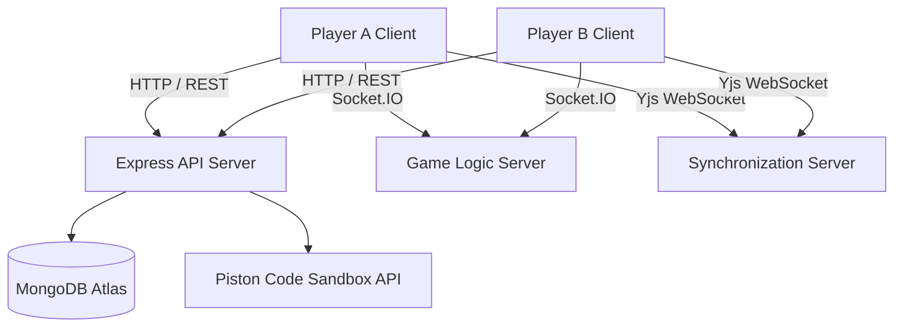

<div align="center">
  

  <h1>CodeArena 1v1</h1>

  <p><strong>CodeArena 1v1 is a premier real-time competitive coding platform designed for developers to engage in intense, head-to-head algorithmic duels.</strong><br>
  <strong>Built with modern web technologies, it offers a seamless, low-latency collaborative environment with secure, sandboxed code execution.</strong><br>
  <strong>Elevate your coding proficiency, climb the global leaderboards, and experience the thrill of real-time software engineering challenges.</strong></p>

  <p>
    <a href="https://code-arena-1v1.vercel.app/"><strong>Explore the Live Demo</strong></a> ·
    <a href="#key-features"><strong>Features</strong></a> ·
    <a href="#getting-started"><strong>Installation</strong></a> ·
    <a href="#architecture-overview"><strong>Architecture</strong></a>
  </p>
</div>

<br />

## Table of Contents
- [Overview](#overview)
- [Key Features](#key-features)
- [Technology Stack](#technology-stack)
- [Architecture Overview](#architecture-overview)
- [Getting Started](#getting-started)
  - [Prerequisites](#prerequisites)
  - [Local Installation](#local-installation)
- [Deployment Guide](#deployment-guide)
- [Screenshots](#screenshots)
- [Contributing](#contributing)
- [Project Structure](#project-structure)
- [License](#license)

## Overview

CodeArena 1v1 transforms algorithmic problem-solving into a dynamic, competitive e-sport. Engineered for high performance and low latency, the platform allows players to create private rooms, invite opponents, and battle in real-time. 

Spectate your opponent's progress through a read-only live preview, execute code in a secure, isolated sandbox environment, and receive instant feedback on multiple test cases. With integrated matchmaking, live scoring, and comprehensive match analytics, CodeArena provides a highly polished, professional-grade coding experience.

## Key Features

### ⚔️ Real-Time Competitive Gameplay
- **Private Matchmaking:** Generate unique room codes to instantly challenge peers.
- **Collaborative Editor Synchronization:** Ultra-low latency code editing powered by Yjs and WebSockets.
- **Live Opponent Preview:** Monitor your adversary’s cursor movements and code logic in a secure, read-only panel.

### ⚙️ Robust Judging & Execution
- **Sandboxed Code Execution:** Utilizes the Piston API for secure, isolated code execution across multiple languages.
- **Automated Multi-Test Validation:** Evaluates submissions against both public and hidden algorithmic test cases.
- **Optimized Execution Flow:** Employs sequential queuing to guarantee maximum performance and prevent API rate limiting.

### 📊 Comprehensive Analytics & Gamification
- **Persistent Match History:** Track individual wins, losses, and detailed opponent metrics.
- **Dynamic Ranking System:** Ascend the leaderboards based on continuous engagement and coding accuracy.
- **Real-Time Telemetry:** Live counters for active players, registered users, and instantaneous score updates.

### 🖥️ Premium User Experience
- **Responsive Modern UI:** Crafted with Tailwind CSS, ensuring accessibility and cross-device compatibility.
- **Adaptive Theming:** Integrated Light and Dark mode toggles tailored for developer comfort.
- **Seamless State Management:** Fluid loading indicators, toast notifications, and interactive dashboards.

## Technology Stack

The platform leverages a robust, modern technology stack to ensure scalability, responsiveness, and security.

- **Frontend:** React.js, Vite, Tailwind CSS, CodeMirror 6
- **Real-Time Synchronization:** Socket.IO, Yjs, `y-websocket`, `y-codemirror`
- **Backend Infrastructure:** Node.js, Express.js, Socket.IO
- **Database & Storage:** MongoDB, Mongoose ODM
- **Execution Engine:** Piston Code Runner API
- **Cloud Deployment:** Vercel (Frontend), Render (Backend / Yjs Servers)

## Architecture Overview

To achieve seamless scalability and fault tolerance, CodeArena decouples core game logic from high-frequency real-time synchronization.

1. **Game Server:** Manages REST APIs, authentication, state machines for active matches, scoring, and persistent data operations.
2. **Yjs Synchronization Server:** Exclusively handles collaborative document states, differential updates, and real-time cursor presence.


```mermaid
graph TD
  BrowserA[Player A Client] -->|HTTP / REST| API[Express API Server]
  BrowserB[Player B Client] -->|HTTP / REST| API

  BrowserA -->|Socket.IO| GameServer[Game Logic Server]
  BrowserB -->|Socket.IO| GameServer

  BrowserA -->|Yjs WebSocket| YjsServer[Synchronization Server]
  BrowserB -->|Yjs WebSocket| YjsServer

  API --> MongoDB[(MongoDB Atlas)]
  API --> Piston[Piston Code Sandbox API]
```

## Getting Started

### Prerequisites

Ensure you have the following installed on your local development environment:
- Node.js (v18.0.0 or higher)
- MongoDB Atlas account (or a local MongoDB instance)
- Git version control

### Local Installation

#### 1. Backend Service Setup

```bash
# Navigate to the backend directory
cd backend

# Install dependencies
npm install
```

Configure your environment variables by creating a `.env` file in the `backend/` directory:

```env
PORT=5000
MONGO_URI=your_mongodb_connection_string
JWT_SECRET=your_highly_secure_jwt_secret
FRONTEND_URL=http://localhost:5173
```

Seed the database with initial coding challenges:

```bash
npm run seed  # Or node seeder.js
```

Start the backend game server:

```bash
npm run dev
```

#### 2. Synchronization Server Setup

Open a secondary terminal instance to launch the Yjs collaboration server:

```bash
cd backend
npm run yjs
```

#### 3. Frontend Application Setup

```bash
# Navigate to the frontend directory
cd frontend

# Install dependencies
npm install
```

Create a `.env` file in the `frontend/` directory with the following variables:

```env
VITE_API_URL=http://localhost:5000
VITE_YJS_URL=ws://localhost:1234
```

Boot the frontend development server:

```bash
npm run dev
```

The application will now be accessible at `http://localhost:5173`.

## Deployment Guide

CodeArena is designed for standard cloud deployment workflows.

### Backend Infrastructure (Render / Heroku)
- Provision two separate web services: one for the Express API and one for the Yjs synchronization server.
- Ensure the Yjs server operates on a distinct port (e.g., `10000`).
- Apply the appropriate `.env` configurations:
  ```env
  PORT=5000
  MONGO_URI=your_production_mongodb
  JWT_SECRET=your_production_jwt_secret
  FRONTEND_URL=https://your-production-frontend-url.com
  ```

### Frontend Infrastructure (Vercel / Netlify)
- Connect your repository and configure the build command (`npm run build`) and output directory (`dist`).
- Set production environment variables to map to your deployed backend endpoints:
  ```env
  VITE_API_URL=https://your-production-api-url.com
  VITE_YJS_URL=wss://your-production-yjs-url.com
  ```

## Screenshots

*Note: Replace placeholder image links with actual production screenshots.*

| Landing Dashboard | Active Match Arena |
| ----------------- | ------------------ |
|  |  |

## Contributing

We welcome contributions from the open-source community to enhance CodeArena.

1. **Fork** the repository on GitHub.
2. **Clone** your fork locally: `git clone https://github.com/your-username/CodeArena-1v1.git`
3. **Create a feature branch:** `git checkout -b feature/amazing-new-feature`
4. **Commit your changes:** `git commit -m 'feat: implement amazing new feature'`
5. **Push to the branch:** `git push origin feature/amazing-new-feature`
6. **Open a Pull Request** detailing your modifications.

## Project Structure

```text
CodeArena-1v1/
├── backend/                  # Enterprise-grade Express & Socket.IO backend
│   ├── controllers/          # API route handlers
│   ├── models/               # Mongoose database schemas
│   ├── routes/               # Express API routing definitions
│   └── services/             # Core business logic and external API integrations
├── frontend/                 # High-performance React + Vite client
│   ├── src/
│   │   ├── components/       # Reusable UI elements (Tailwind CSS)
│   │   ├── pages/            # Top-level route components
│   │   └── utils/            # Helper functions and hooks
└── README.md                 # Project documentation
```

## License

This software is released under the terms of the [MIT License](./LICENSE).

---
<div align="center">
  <p>Engineered with precision and designed for performance by <strong>Mayank</strong>.</p>
</div>
